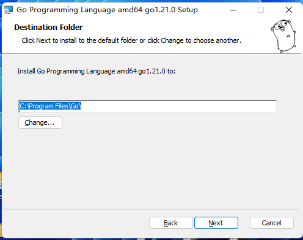

### 环境
1. windows11
2. go version 
go version go1.21.0 windows/amd64

### 安装
1. windows安装golang环境


D:\Program Files\Go\

```bash
set GO111MODULE=
set GOARCH=amd64
set GOBIN=
set GOCACHE=C:\Users\SY008\AppData\Local\go-build
set GOENV=C:\Users\SY008\AppData\Roaming\go\env
set GOEXE=.exe
set GOEXPERIMENT=
set GOFLAGS=
set GOHOSTARCH=amd64
set GOHOSTOS=windows
set GOINSECURE=
set GOMODCACHE=C:\Users\SY008\go\pkg\mod
set GONOPROXY=
set GONOSUMDB=
set GOOS=windows
set GOPATH=C:\Users\SY008\go
set GOPRIVATE=
set GOPROXY=https://proxy.golang.org,direct
set GOROOT=D:\Program Files\Go
set GOSUMDB=sum.golang.org
set GOTMPDIR=
set GOTOOLCHAIN=auto
set GOTOOLDIR=D:\Program Files\Go\pkg\tool\windows_amd64
set GOVCS=
set GOVERSION=go1.21.0
set GCCGO=gccgo
set GOAMD64=v1
set AR=ar
set CC=gcc
set CXX=g++
set CGO_ENABLED=0
set GOMOD=NUL
set GOWORK=
set CGO_CFLAGS=-O2 -g
set CGO_CPPFLAGS=
set CGO_CXXFLAGS=-O2 -g
set CGO_FFLAGS=-O2 -g
set CGO_LDFLAGS=-O2 -g
set PKG_CONFIG=pkg-config
set GOGCCFLAGS=-m64 -fno-caret-diagnostics -Qunused-arguments -Wl,--no-gc-sections -fmessage-length=0 -ffile-prefix-map=
```

开启国内代理
```
go env -w GO111MODULE=on
go env -w GOPROXY=https://goproxy.cn,direct
```
这里如果不改，下载包就会比较慢


### gin
main.go
```go
package main

import "github.com/gin-gonic/gin"

func main() {
	r := gin.Default()
	r.GET("/ping", func(c *gin.Context) {
		c.JSON(200, gin.H{
			"message": "pong",
		})
	})
	r.Run() // 监听并在 0.0.0.0:8080 上启动服务
}
```
访问： http://localhost:8080/ping


> go常用命令参考
https://cloud.tencent.com/developer/article/2270893


```
go env 
// GOPATH 指定了 Go 语言工作区的路径，它包含了你的项目源代码、依赖库以及编译后的可执行文件等
GOPATH
pkg
bin 
src
// GOROOT 指定了 Go 工具链的安装路径，它包含了 Go 语言的标准库、编译器等工具
GOROOT

import "fmt" // 这里的"fmt"是标准库package fmt所在的路径"$GOROOT/src/fmt/"  不是指package fmt本身包名(所谓的巧合,正好一致而已)

标准库包: 源码在$GOROOT/src下
第三方依赖包: 源码在$GOPATH/src下
```


