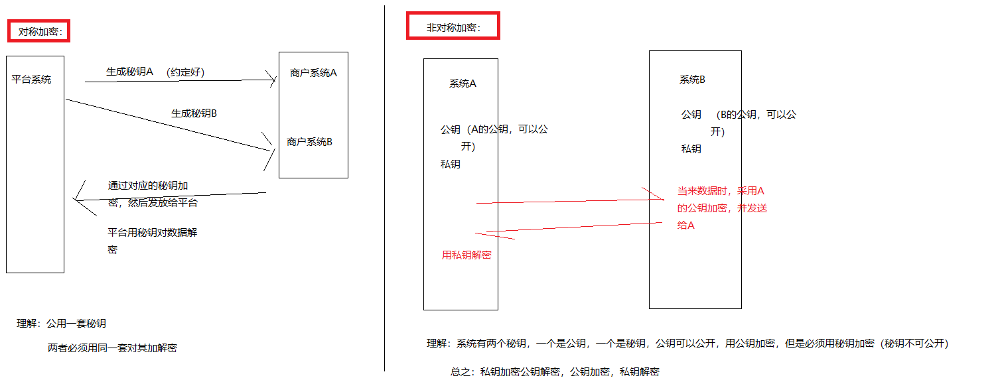

### 对称加密 && 非对称加密
对称加密中，我们只需要一个密钥，通信双方同时持有。而非对称加密需要4个密钥。通信双方各自准备一对公钥和私钥。其中公钥是公开的，由信息接受方提供给信息发送方。公钥用来对信息加密。私钥由信息接受方保留，用来解密。既然公钥是公开的，就不存在保密问题。也就是说非对称加密完全不存在密钥配送问题！你看，是不是完美解决了密钥配送问题？

AES, DES 为常用的对称加密算法
RSA 为现有常用的非对称加密算法

### 证书
证书：公钥信息 + 额外的其他信息（比如所属的实体，采用的加密解密算法等）= 证书。证书文件的扩展名一般为crt
拿到一个证书之后，可以通过openssl相关的命令来查看该证书的相关信息：

### 证书认证中心（CA）

拿到一个证书之后，得先去找CA验证下，拿到的证书是否是一个“真”的证书，而不是一个篡改后的证书。如果确认证书没有问题，那么从证书中拿到公钥之后，就可以与对方进行安全的通信了，基于非对称加密机制。
